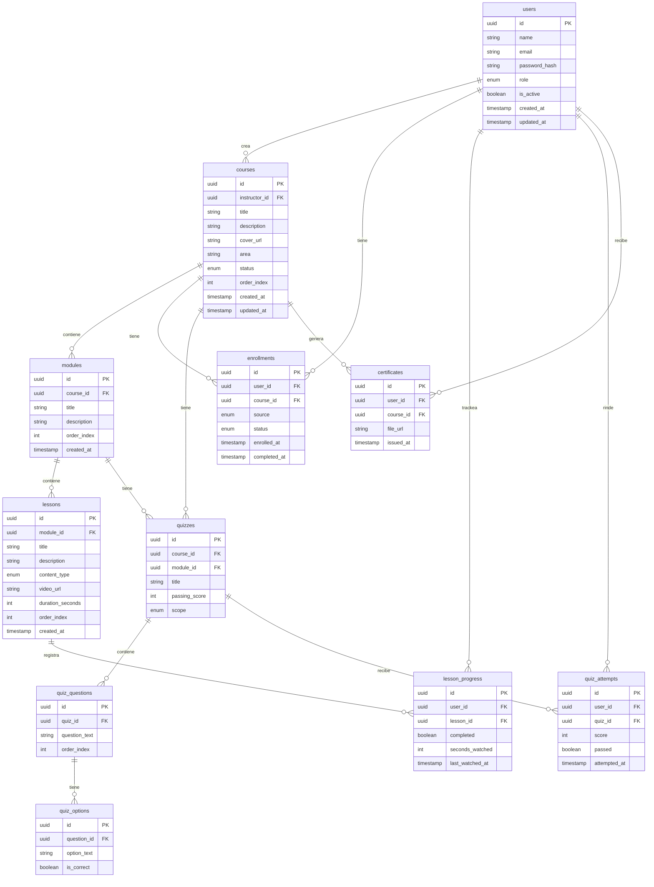

# RevoLab — Especificación Técnica MVP1

> Documento consolidado a partir de: `RevoLab_Modelo_de_Datos_MVP1.pdf`, `revolab_erd.pdf` y `RevoLab_Matriz_Roles_MVP1.docx`
> Versión 1.0 · Junio 2025
>
> **Propósito de este archivo:** servir como fuente única de verdad para verificar que la implementación (schema de Prisma, middlewares, guards de rutas, validaciones de servicio) respeta exactamente el modelo de datos y la matriz de roles definidos. Si algo en el código no calza con este documento, el código está mal — no el documento.

---

## Índice

1. [Resumen del modelo de datos](#1-resumen-del-modelo-de-datos)
2. [Definición de entidades](#2-definición-de-entidades)
3. [Diagrama entidad-relación](#3-diagrama-entidad-relación)
4. [Relaciones entre entidades](#4-relaciones-entre-entidades)
5. [Valores de enumeraciones](#5-valores-de-enumeraciones)
6. [Reglas de negocio críticas](#6-reglas-de-negocio-críticas)
7. [Índices recomendados](#7-índices-recomendados)
8. [Roles y permisos](#8-roles-y-permisos)
9. [Reglas de implementación (auth/backend)](#9-reglas-de-implementación-authbackend)
10. [Códigos HTTP de respuesta](#10-códigos-http-de-respuesta)
11. [Decisiones pendientes para MVP2](#11-decisiones-pendientes-para-mvp2)

---

## 1. Resumen del modelo de datos

El modelo de datos de RevoLab MVP1 está compuesto por **11 entidades** organizadas en **4 dominios funcionales**:

| Dominio | Entidades | Responsabilidad |
|---|---|---|
| Identidad | `users` | Autenticación, roles y perfil de usuario |
| Contenido | `courses`, `modules`, `lessons` | Estructura jerárquica del material educativo |
| Participación | `enrollments`, `lesson_progress` | Inscripción y avance del usuario en el contenido |
| Evaluación | `quizzes`, `quiz_questions`, `quiz_options`, `quiz_attempts` | Pruebas a nivel módulo y curso, con intentos por usuario |
| Certificación | `certificates` | Emisión del certificado al completar un curso |

**Decisión clave:** los quizzes pueden asociarse a un curso O a un módulo (campo `scope` + FK nullable). Esto permite pruebas por módulo y una prueba final de curso sin duplicar la entidad.

---

## 2. Definición de entidades

### 2.1 `users`

Usuarios de la plataforma. El campo `role` define el nivel de acceso: `admin`, `instructor` o `learner`.

| Campo | Tipo | Restricción | Descripción |
|---|---|---|---|
| id | UUID | PK | Identificador único del usuario |
| name | VARCHAR(120) | NOT NULL | Nombre completo |
| email | VARCHAR(255) | UNIQUE NOT NULL | Correo corporativo. Se usa como credencial de login |
| password_hash | VARCHAR(255) | NOT NULL | Hash de la contraseña (bcrypt). Nunca se almacena en texto plano |
| role | ENUM('admin','instructor','learner') | NOT NULL DEFAULT learner | Rol que determina el nivel de acceso a la plataforma |
| is_active | BOOLEAN | NOT NULL DEFAULT true | Permite deshabilitar el acceso sin eliminar el registro |
| created_at | TIMESTAMP | NOT NULL DEFAULT now() | Fecha de creación del registro |
| updated_at | TIMESTAMP | NOT NULL DEFAULT now() | Fecha de última actualización (autoupdate) |

> El rol `instructor` es un subconjunto de `learner` con permisos adicionales de creación. Un instructor también puede inscribirse en cursos como learner.

### 2.2 `courses`

Unidad principal de contenido. Cada curso pertenece a un área temática y tiene un único instructor responsable.

| Campo | Tipo | Restricción | Descripción |
|---|---|---|---|
| id | UUID | PK | Identificador único del curso |
| instructor_id | UUID | FK → users.id, NOT NULL | Usuario instructor responsable del curso. Relación 1:1 por curso |
| title | VARCHAR(200) | NOT NULL | Nombre del curso que se muestra en el catálogo y descripción |
| description | TEXT | NOT NULL | Descripción larga: qué aprenderá el usuario, a quién va dirigido |
| cover_url | VARCHAR(500) | NULLABLE | URL de la imagen de portada almacenada en R2 de Cloudflare |
| area | VARCHAR(100) | NOT NULL | Área temática del curso (ej: Tecnología, Ventas, RRHH). Permite filtrar en el catálogo |
| status | ENUM('draft','published','archived') | NOT NULL DEFAULT draft | draft: solo visible para el instructor. published: visible en catálogo. archived: oculto |
| order_index | INTEGER | NOT NULL DEFAULT 0 | Orden de aparición del curso en el catálogo por área |
| created_at | TIMESTAMP | NOT NULL DEFAULT now() | Fecha de creación |
| updated_at | TIMESTAMP | NOT NULL DEFAULT now() | Fecha de última actualización |

### 2.3 `modules`

Agrupación temática dentro de un curso. Un curso tiene uno o más módulos ordenados secuencialmente.

| Campo | Tipo | Restricción | Descripción |
|---|---|---|---|
| id | UUID | PK | Identificador único del módulo |
| course_id | UUID | FK → courses.id, NOT NULL | Curso al que pertenece el módulo |
| title | VARCHAR(200) | NOT NULL | Nombre del módulo (ej: "Módulo 1: Fundamentos") |
| description | TEXT | NULLABLE | Descripción opcional del módulo y sus objetivos |
| order_index | INTEGER | NOT NULL DEFAULT 0 | Orden de aparición dentro del curso. Se ordena ASC para determinar la secuencia |
| created_at | TIMESTAMP | NOT NULL DEFAULT now() | Fecha de creación |

### 2.4 `lessons`

Unidad mínima de contenido dentro de un módulo. Puede ser un video, texto o ambos.

| Campo | Tipo | Restricción | Descripción |
|---|---|---|---|
| id | UUID | PK | Identificador único de la lección |
| module_id | UUID | FK → modules.id, NOT NULL | Módulo al que pertenece la lección |
| title | VARCHAR(200) | NOT NULL | Nombre de la lección, se muestra en el player y el índice del curso |
| description | TEXT | NULLABLE | Descripción breve, se muestra antes de reproducir el video |
| content_type | ENUM('video','text','mixed') | NOT NULL DEFAULT video | Tipo de contenido principal de la lección |
| video_url | VARCHAR(500) | NULLABLE | URL del video en R2 de Cloudflare. Obligatorio si content_type es video o mixed |
| duration_seconds | INTEGER | NULLABLE | Duración total del video en segundos. Se usa para el tiempo estimado |
| order_index | INTEGER | NOT NULL DEFAULT 0 | Orden dentro del módulo. Determina la secuencia de reproducción |
| created_at | TIMESTAMP | NOT NULL DEFAULT now() | Fecha de creación |

> Los archivos de video se almacenan en R2 de Cloudflare. La URL en `video_url` es la URL de acceso al objeto. En MVP2 se puede agregar signed URL con expiración para proteger el contenido.

### 2.5 `enrollments`

Registro de inscripción de un usuario a un curso. Soporta inscripción manual por admin y auto-inscripción por el usuario.

| Campo | Tipo | Restricción | Descripción |
|---|---|---|---|
| id | UUID | PK | Identificador único de la inscripción |
| user_id | UUID | FK → users.id, NOT NULL | Usuario inscrito |
| course_id | UUID | FK → courses.id, NOT NULL | Curso en el que se inscribe |
| source | ENUM('self','admin') | NOT NULL | Origen de la inscripción: self = el usuario se inscribió solo, admin = fue asignado |
| status | ENUM('active','completed','dropped') | NOT NULL DEFAULT active | active: en progreso. completed: finalizó. dropped: abandonó |
| enrolled_at | TIMESTAMP | NOT NULL DEFAULT now() | Fecha y hora de inscripción |
| completed_at | TIMESTAMP | NULLABLE | Fecha de finalización. Se rellena al completar todos los módulos y aprobar el quiz del curso |

> **UNIQUE** constraint en `(user_id, course_id)` para evitar inscripciones duplicadas. Si un admin reinscribe a un usuario, se debe **actualizar** el registro existente, no crear uno nuevo.

### 2.6 `lesson_progress`

Registra el avance del usuario lección por lección. Es la base del cálculo de progreso total del curso.

| Campo | Tipo | Restricción | Descripción |
|---|---|---|---|
| id | UUID | PK | Identificador único del registro de progreso |
| user_id | UUID | FK → users.id, NOT NULL | Usuario cuyo progreso se registra |
| lesson_id | UUID | FK → lessons.id, NOT NULL | Lección a la que corresponde el progreso |
| completed | BOOLEAN | NOT NULL DEFAULT false | true cuando el usuario vio al menos el umbral de reproducción |
| seconds_watched | INTEGER | NOT NULL DEFAULT 0 | Total de segundos reproducidos. Permite calcular % visto |
| last_watched_at | TIMESTAMP | NULLABLE | Última vez que el usuario accedió a esta lección. Sirve para retomar |

> **UNIQUE** constraint en `(user_id, lesson_id)`. El progreso del curso se calcula como: lecciones completadas / total de lecciones del curso × 100.

### 2.7 `quizzes`

Prueba de evaluación. Puede estar asociada a un módulo (evaluación parcial) o a un curso completo (prueba final). El campo `scope` distingue el alcance.

| Campo | Tipo | Restricción | Descripción |
|---|---|---|---|
| id | UUID | PK | Identificador único del quiz |
| course_id | UUID | FK → courses.id, NULLABLE | Obligatorio si scope es course |
| module_id | UUID | FK → modules.id, NULLABLE | Obligatorio si scope es module |
| title | VARCHAR(200) | NOT NULL | Título descriptivo (ej: "Prueba final — Módulo 2") |
| passing_score | INTEGER | NOT NULL DEFAULT 60 | Puntaje mínimo para aprobar (0-100) |
| scope | ENUM('module','course') | NOT NULL | Determina si es prueba de módulo o prueba final de curso |

> **Regla de integridad:** si `scope = module`, `module_id` debe ser NOT NULL y `course_id` puede ser NULL. Si `scope = course`, `course_id` debe ser NOT NULL y `module_id` debe ser NULL.
> ⚠️ **Esta regla NO está forzada como CHECK constraint en el doc original — solo documentada.** Verificar que el schema real la implemente a nivel de base de datos y no solo en el service layer.

### 2.8 `quiz_questions`

Preguntas individuales que componen un quiz. Cada pregunta tiene entre 2 y 4 opciones de respuesta.

| Campo | Tipo | Restricción | Descripción |
|---|---|---|---|
| id | UUID | PK | Identificador único de la pregunta |
| quiz_id | UUID | FK → quizzes.id, NOT NULL | Quiz al que pertenece la pregunta |
| question_text | TEXT | NOT NULL | Enunciado de la pregunta que se muestra al usuario |
| order_index | INTEGER | NOT NULL DEFAULT 0 | Orden de aparición dentro del quiz |

### 2.9 `quiz_options`

Opciones de respuesta para cada pregunta. Solo una opción puede ser correcta por pregunta en el MVP1.

| Campo | Tipo | Restricción | Descripción |
|---|---|---|---|
| id | UUID | PK | Identificador único de la opción |
| question_id | UUID | FK → quiz_questions.id, NOT NULL | Pregunta a la que pertenece la opción |
| option_text | VARCHAR(500) | NOT NULL | Texto de la opción de respuesta |
| is_correct | BOOLEAN | NOT NULL DEFAULT false | true para la respuesta correcta. Solo debe haber una por pregunta |

> En MVP1 se asume una sola respuesta correcta por pregunta (single choice). Para opción múltiple, extender en MVP2 con `question_type` en `quiz_questions`.

### 2.10 `quiz_attempts`

Registra cada intento de un usuario en un quiz, con el puntaje obtenido y si aprobó o no.

| Campo | Tipo | Restricción | Descripción |
|---|---|---|---|
| id | UUID | PK | Identificador único del intento |
| user_id | UUID | FK → users.id, NOT NULL | Usuario que rindió el quiz |
| quiz_id | UUID | FK → quizzes.id, NOT NULL | Quiz que se intentó |
| score | INTEGER | NOT NULL | Puntaje obtenido (0-100): respuestas correctas / total × 100 |
| passed | BOOLEAN | NOT NULL | true si score >= passing_score del quiz |
| attempted_at | TIMESTAMP | NOT NULL DEFAULT now() | Fecha y hora en que se completó el intento |

> Se permiten **múltiples intentos** por usuario por quiz. Para el estado actual del usuario, se toma el último intento (`attempted_at DESC`). MVP2: límite de intentos.

### 2.11 `certificates`

Certificado de finalización de un curso. Se emite automáticamente cuando el usuario completa todas las lecciones y aprueba el quiz final del curso.

| Campo | Tipo | Restricción | Descripción |
|---|---|---|---|
| id | UUID | PK | Identificador único del certificado |
| user_id | UUID | FK → users.id, NOT NULL | Usuario que recibe el certificado |
| course_id | UUID | FK → courses.id, NOT NULL | Curso que se certifica |
| file_url | VARCHAR(500) | NULLABLE | URL del PDF en R2. NULL hasta que se genere el archivo |
| issued_at | TIMESTAMP | NOT NULL DEFAULT now() | Fecha de emisión, se imprime en el PDF |

> **UNIQUE** constraint en `(user_id, course_id)`. Un usuario solo puede tener un certificado por curso. La generación del PDF puede ser asíncrona.

---

## 3. Diagrama entidad-relación



---

## 4. Relaciones entre entidades

| Entidad A | Cardinalidad | Entidad B | Descripción |
|---|---|---|---|
| users | 1 → N | courses | Un instructor puede crear múltiples cursos |
| users | 1 → N | enrollments | Un usuario puede inscribirse en múltiples cursos |
| users | 1 → N | lesson_progress | Un usuario tiene un registro de progreso por cada lección vista |
| users | 1 → N | quiz_attempts | Un usuario puede tener múltiples intentos en múltiples quizzes |
| users | 1 → N | certificates | Un usuario puede obtener un certificado por cada curso completado |
| courses | 1 → N | modules | Un curso contiene uno o más módulos ordenados |
| courses | 1 → N | enrollments | Un curso puede tener múltiples usuarios inscritos |
| courses | 1 → N | quizzes | Un curso puede tener un quiz final (scope = course) |
| courses | 1 → N | certificates | Un curso puede generar certificados para múltiples usuarios |
| modules | 1 → N | lessons | Un módulo contiene una o más lecciones ordenadas |
| modules | 1 → N | quizzes | Un módulo puede tener un quiz de evaluación parcial (scope = module) |
| lessons | 1 → N | lesson_progress | Una lección puede tener registros de progreso de múltiples usuarios |
| quizzes | 1 → N | quiz_questions | Un quiz contiene una o más preguntas |
| quizzes | 1 → N | quiz_attempts | Un quiz puede recibir múltiples intentos de múltiples usuarios |
| quiz_questions | 1 → N | quiz_options | Cada pregunta tiene entre 2 y 4 opciones de respuesta |

---

## 5. Valores de enumeraciones

| Entidad.campo | Valores | Descripción |
|---|---|---|
| users.role | admin \| instructor \| learner | admin: acceso total. instructor: crea y gestiona cursos propios. learner: solo consume contenido |
| courses.status | draft \| published \| archived | draft: borrador, invisible en catálogo. published: visible. archived: desactivado |
| lessons.content_type | video \| text \| mixed | Tipo de contenido principal de la lección |
| enrollments.source | self \| admin | Origen de la inscripción del usuario al curso |
| enrollments.status | active \| completed \| dropped | Estado actual de la inscripción |
| quizzes.scope | module \| course | Determina si el quiz evalúa un módulo o el curso completo |

---

## 6. Reglas de negocio críticas

**Completar una lección**
Una lección se marca como completada (`lesson_progress.completed = true`) cuando el usuario ha visto al menos el 80% de la duración del video (`seconds_watched >= duration_seconds × 0.8`). Si la lección no tiene video (`content_type = text`), se marca como completada al abrir la lección.

**Progreso de un curso**
El porcentaje de progreso se calcula dinámicamente: `(lecciones completadas del curso / total de lecciones del curso) × 100`. **No se almacena** en la base de datos para evitar inconsistencias; se calcula en el backend al momento de la consulta.

**Completar un curso**
Un curso se marca como completado (`enrollments.status = completed`, `enrollments.completed_at = now()`) cuando se cumplen ambas condiciones: (1) todas las lecciones del curso están completadas, y (2) el último intento del quiz final del curso tiene `passed = true`. Si el curso no tiene quiz final, basta con completar todas las lecciones.

**Emisión del certificado**
El certificado se genera automáticamente cuando el enrollment pasa a `status = completed`. Se crea el registro en `certificates` con `issued_at = now()` y se genera el PDF de forma asíncrona, actualizando `file_url` cuando esté listo.

**Inscripción duplicada**
El constraint UNIQUE `(user_id, course_id)` en `enrollments` impide inscripciones duplicadas a nivel de base de datos. A nivel de aplicación, si un admin intenta inscribir a un usuario ya inscrito, se debe retornar un error descriptivo (409 Conflict) sin crear un nuevo registro.

---

## 7. Índices recomendados

| Tabla | Índice | Justificación |
|---|---|---|
| enrollments | UNIQUE (user_id, course_id) | Evita duplicados e índice para buscar inscripciones de un usuario |
| lesson_progress | UNIQUE (user_id, lesson_id) | Evita duplicados. Consulta de progreso por usuario y curso es frecuente |
| lesson_progress | INDEX (user_id) | Para calcular el progreso total del usuario en un curso |
| quiz_attempts | INDEX (user_id, quiz_id) | Para obtener el último intento de un usuario en un quiz |
| certificates | UNIQUE (user_id, course_id) | Evita certificados duplicados por usuario y curso |
| courses | INDEX (area, status) | Para filtrar el catálogo por área mostrando solo publicados |
| lessons | INDEX (module_id, order_index) | Para obtener lecciones ordenadas dentro de un módulo |

---

## 8. Roles y permisos

### 8.1 Los tres roles

RevoLab opera con exactamente tres roles. Cada usuario tiene uno y solo uno asignado en el campo `role` de la tabla `users`.

| Rol | Quién es | Qué hace en la plataforma |
|---|---|---|
| admin | Equipo de RRHH o TI | Gestiona usuarios, inscripciones, configuración del sistema y tiene visibilidad total de métricas y contenido |
| instructor | Experto interno o formador | Crea y gestiona sus propios cursos, módulos, lecciones y quizzes. También puede inscribirse y consumir cursos como learner |
| learner | Empleado que se capacita | Explora el catálogo, se inscribe en cursos, consume lecciones, rinde quizzes y descarga sus certificados |

> Un instructor también es un learner. Tiene acceso a todas las funciones de consumo de contenido además de las de creación. El rol instructor es un **superconjunto** del rol learner.

### 8.2 Leyenda de permisos

| Nivel | Significado |
|---|---|
| **Total** | Acceso completo. Puede operar sobre cualquier registro del sistema, sin restricción de propiedad |
| **Solo propios** | Solo los registros que el usuario creó o que le pertenecen directamente. El backend valida la propiedad antes de ejecutar |
| **Si inscrito** | Solo si existe un registro en `enrollments` con `status = active` para ese usuario y ese curso. Sin enrollment, la respuesta es 403 |
| **No** | Sin acceso. La API retorna 403 Forbidden independientemente de si el recurso existe o no |

> **Regla de seguridad:** ante cualquier duda, la respuesta es 403 Forbidden, no 404 Not Found. Revelar que un recurso existe pero no está permitido filtra información.

### 8.3 Matriz completa de permisos

#### Usuarios

| Acción | Admin | Instructor | Learner |
|---|---|---|---|
| Ver lista de usuarios (directorio completo) | Total | No | No |
| Crear usuario (invitar/registrar) | Total | No | No |
| Editar usuario (nombre, rol, área, estado) | Total | No | No |
| Desactivar / activar usuario (`is_active`) | Total | No | No |
| Ver y editar perfil propio | Total | Total | Total |

#### Cursos

| Acción | Admin | Instructor | Learner |
|---|---|---|---|
| Ver catálogo de cursos (`status = published`) | Total | Total | Total |
| Ver cursos en borrador (`status = draft`) | Total | Solo propios | No |
| Crear curso (nuevo registro en draft) | Total | Total | No |
| Editar curso (título, descripción, portada, área) | Total | Solo propios | No |
| Publicar curso (draft → published) | Total | Solo propios | No |
| Archivar curso (published → archived) | Total | Solo propios | No |
| Eliminar curso | Total | No | No |

#### Módulos y lecciones

| Acción | Admin | Instructor | Learner |
|---|---|---|---|
| Ver módulos y lecciones (índice del curso) | Total | Total | Si inscrito |
| Crear módulo / lección | Total | Solo propios | No |
| Editar módulo / lección (título, descripción, orden) | Total | Solo propios | No |
| Eliminar módulo / lección | Total | Solo propios | No |
| Subir video (upload a Cloudflare R2) | Total | Solo propios | No |
| Reproducir lección (acceso al player y video) | Total | Total | Si inscrito |

#### Inscripciones

| Acción | Admin | Instructor | Learner |
|---|---|---|---|
| Ver todas las inscripciones (listado global) | Total | No | No |
| Ver inscritos de sus cursos | Total | Solo propios | No |
| Inscribir manualmente (`source = admin`) | Total | No | No |
| Auto-inscribirse (`source = self`) | Total | Total | Total |
| Ver inscripciones propias | Total | Total | Total |
| Cancelar inscripción (`status = dropped`) | Total | No | Solo propios |

#### Quizzes

| Acción | Admin | Instructor | Learner |
|---|---|---|---|
| Crear y editar quiz (preguntas y opciones) | Total | Solo propios | No |
| Rendir quiz (crear `quiz_attempt`) | Total | Total | Si inscrito |
| Ver resultados (todos los intentos del sistema) | Total | No | No |
| Ver resultados de su curso | Total | Solo propios | No |
| Ver resultados propios | Total | Total | Total |

#### Progreso

| Acción | Admin | Instructor | Learner |
|---|---|---|---|
| Ver progreso de todos (dashboard global) | Total | No | No |
| Ver progreso de su curso | Total | Solo propios | No |
| Ver progreso propio | Total | Total | Total |

#### Certificados

| Acción | Admin | Instructor | Learner |
|---|---|---|---|
| Ver todos los certificados (listado global) | Total | No | No |
| Descargar certificado propio (PDF) | Total | Total | Total |
| Revocar certificado (eliminar registro) | Total | No | No |

#### Panel de administración

| Acción | Admin | Instructor | Learner |
|---|---|---|---|
| Acceder al panel admin (métricas globales) | Total | No | No |
| Ver métricas de sus cursos (panel de instructor) | Total | Solo propios | No |
| Gestionar áreas temáticas (crear / editar áreas) | Total | No | No |

---

## 9. Reglas de implementación (auth/backend)

**Middleware de autenticación**
Todas las rutas protegidas deben validar en este orden:
1. Token de sesión válido y no expirado
2. Usuario existe y `is_active = true`
3. Rol del usuario tiene permiso para la acción solicitada

Si cualquier check falla, se corta inmediatamente con el código HTTP correspondiente (401 sin token, 403 con token pero sin permiso).

**Validación de propiedad ("solo propios")**
Para recursos con acceso restringido a registros propios, el backend debe hacer el join correspondiente antes de operar. Para módulos y lecciones, la cadena es:

```
lesson.module_id → module.course_id → course.instructor_id === req.user.id
```

Este join debe hacerse **en el servicio, no en el controller**, y debe fallar con 403 si no se cumple.

> Nunca confiar en el `user_id` que viene en el body del request. Siempre tomar el `user_id` del token de sesión validado. Un cliente malicioso puede mandar cualquier ID en el body.

**Validación de enrollment ("si inscrito")**
Antes de servir el contenido de una lección (video URL, módulos, quizzes), el backend debe verificar que exista un enrollment con `user_id = req.user.id`, `course_id = params.courseId`, y `status = active`. Si no existe o el status es `dropped`, retornar 403.

---

## 10. Códigos HTTP de respuesta

| Código | Cuándo usarlo | Detalle |
|---|---|---|
| 401 | No autenticado | No hay token de sesión, el token es inválido o está expirado |
| 403 | No autorizado | Autenticado pero sin permiso para la acción o el recurso. También cuando no se cumple la validación de propiedad o enrollment |
| 409 | Conflicto | Recurso ya existe. Ej: intentar inscribir a un usuario que ya está inscrito en ese curso |

---

## 11. Decisiones pendientes para MVP2

**Del modelo de datos:**

| Tema | Descripción |
|---|---|
| Límite de intentos en quiz | Agregar `max_attempts` en `quizzes` y validar en el backend antes de crear un nuevo `quiz_attempt` |
| Opción múltiple en preguntas | Agregar `question_type` en `quiz_questions` y `allows_multiple` en `quiz_options` |
| Signed URLs para videos | En MVP1 los videos son URLs directas en R2. En MVP2 generar URLs firmadas con expiración |
| Soft delete | Agregar `deleted_at` (nullable) en `courses`, `modules` y `lessons` |
| Rutas de aprendizaje | Nueva entidad `learning_paths` con relación N:M a `courses` para secuencias obligatorias de cursos |
| Notificaciones | Nueva entidad `notifications` para eventos: inscripción, quiz aprobado, certificado emitido |

**De la matriz de roles:**

| Tema | Descripción |
|---|---|
| Instructor puede ver alumnos | En MVP1 el instructor ve los inscritos de sus cursos pero no su perfil completo. MVP2: panel de alumno por curso |
| Rol de supervisor / mentor | El "Espacio Trainee" de Fase 2 requiere un rol `mentor` que pueda ver el progreso de sus asignados y asignarles rutas de aprendizaje |
| Permisos por área temática | Restringir qué cursos puede ver un learner según el área a la que pertenece en la empresa. Requiere campo `area` en `users` y lógica de filtro en el catálogo |

---

## Checklist rápido para auditar contra Claude Code

Usa esto como lista de verificación al revisar lo que ya está implementado:

- [ ] Los 3 roles (`admin`, `instructor`, `learner`) están en un enum, no en una tabla separada de permisos
- [ ] Existe CHECK constraint (o validación equivalente a nivel DB) para el XOR de `quizzes.course_id` / `quizzes.module_id` según `scope`
- [ ] El progreso de curso **no** está guardado en una columna — se calcula al vuelo
- [ ] Existe UNIQUE `(user_id, course_id)` en `enrollments` y UNIQUE `(user_id, lesson_id)` en `lesson_progress`
- [ ] El middleware corta con 401 antes de evaluar permisos, y con 403 (nunca 404) cuando no hay permiso
- [ ] La validación de "solo propios" hace el join completo (`lesson → module → course → instructor_id`) en el service, no confía en IDs del body
- [ ] La validación de "si inscrito" chequea `status = active`, no solo la existencia del enrollment
- [ ] Certificado se dispara automáticamente al pasar `enrollment.status` a `completed`, no por acción manual
- [ ] Todos los índices de la sección 7 existen en el schema real
